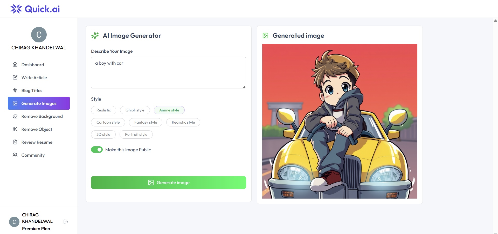
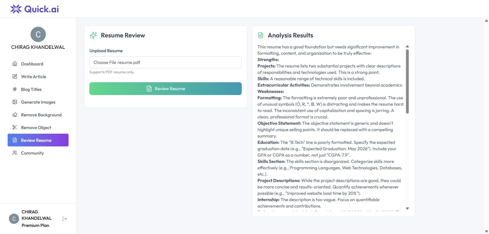
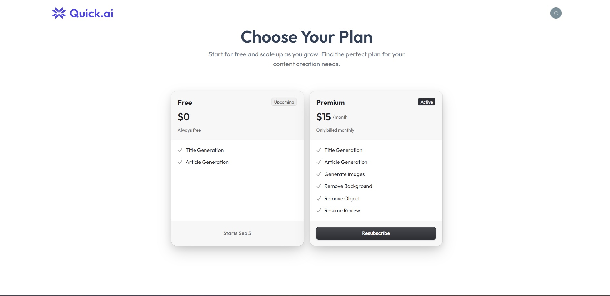

# QuickAI – README

QuickAI is a full‑stack AI web app integrating **Gemini API** and **Clipdrop API** to provide smart content and image tools.

---

## ✨ Features

* Generate articles and blogs (Gemini)
* Review and improve resumes (Gemini)
* Background removal (Clipdrop)
* Object removal from images (Clipdrop)
* Simple, responsive UI for easy use

---

## 🚀 Setup

1. Clone repo & install dependencies (`npm install` in both `client` and `server`).
2. Create `.env` file with:

   ```env
   GEMINI_API_KEY=your_gemini_key
   CLIPDROP_API_KEY=your_clipdrop_key
   ```
3. Run server: `npm run dev` (backend), `npm start` (frontend).

---

## 📌 API Endpoints

* `POST /api/generate-article`
* `POST /api/review-resume`
* `POST /api/remove-bg`
* `POST /api/remove-object`

---

## 📸 Screenshots

### 1. Landing Page  


### 2. Dashboard  


### 3. AI Image Generator  


### 4. Resume Review  


### 5. Pricing Plans  


---

## 📦 Deployment

* Host backend on **Vercel/Render**
* Host frontend on **Netlify/Vercel**

---

## ⚡ Tech Stack

**Frontend:** React, TailwindCSS
**Backend:** Node.js, Express
**AI APIs:** Gemini, Clipdrop

